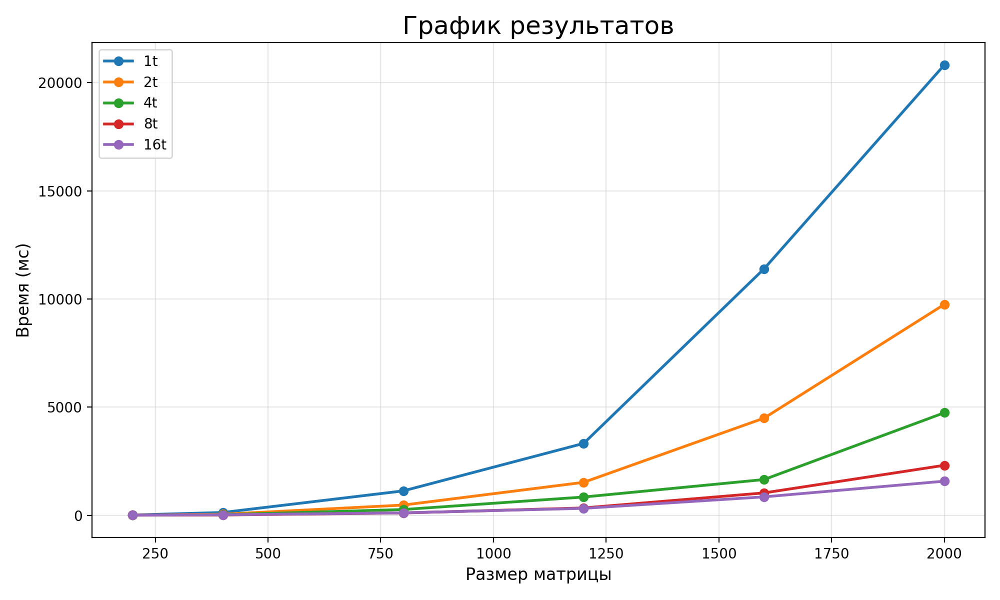

# Лабораторная работа №5

**Выполнил:** Чан Минь Ньят  
**Группа:** 6213  

## Цель работы

Запустить программу из л/р №3 на суперкомпьютере **«Сергей Королёв»** и сравнить время выполнения при разном числе потоков.

## Условия тестирования

- тип данных: `double`
- размеры матриц: `200`, `400`, `800`, `1200`, `1600`, `2000`
- число потоков: `1`, `2`, `4`, `8`, `16`

## Результаты

| Размер | 1 поток | 2 потока | 4 потока | 8 потоков | 16 потоков |
|---|---:|---:|---:|---:|---:|
| 200x200   | 11.312 ms  | 5.721 ms   | 3.401 ms   | 2.312 ms   | 4.893 ms   |
| 400x400   | 128.512 ms | 48.103 ms  | 25.401 ms  | 13.892 ms  | 22.107 ms  |
| 800x800   | 1126.44 ms | 470.892 ms | 265.123 ms | 105.673 ms | 111.456 ms |
| 1200x1200 | 3321.8 ms  | 1522.73 ms | 842.956 ms | 338.456 ms | 319.892 ms |
| 1600x1600 | 11392.6 ms | 4490.12 ms | 1650.88 ms | 1032.89 ms | 850.234 ms |
| 2000x2000 | 20822.5 ms | 9750.88 ms | 4740.45 ms | 2310.34 ms | 1575.67 ms |

## График

## Вывод

По результатам видно, что увеличение числа потоков значительно ускоряет перемножение матриц.  
Для небольших размеров лучшие результаты даёт `8` потоков, а для больших матриц наиболее эффективным оказался запуск с `16` потоками.  
Однопоточная версия работает медленнее всего.
