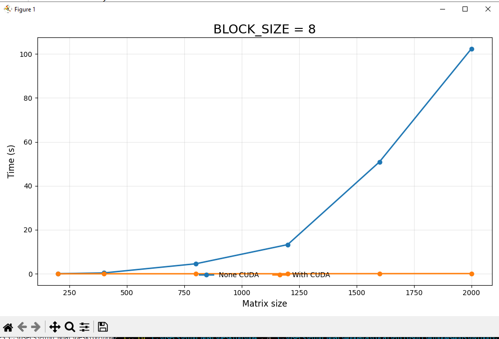
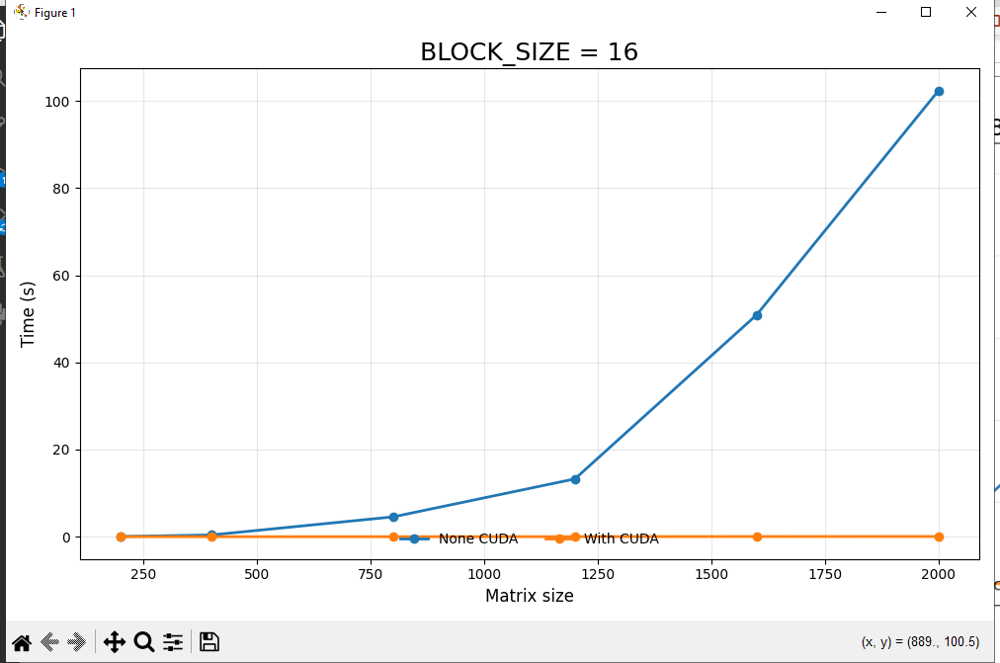
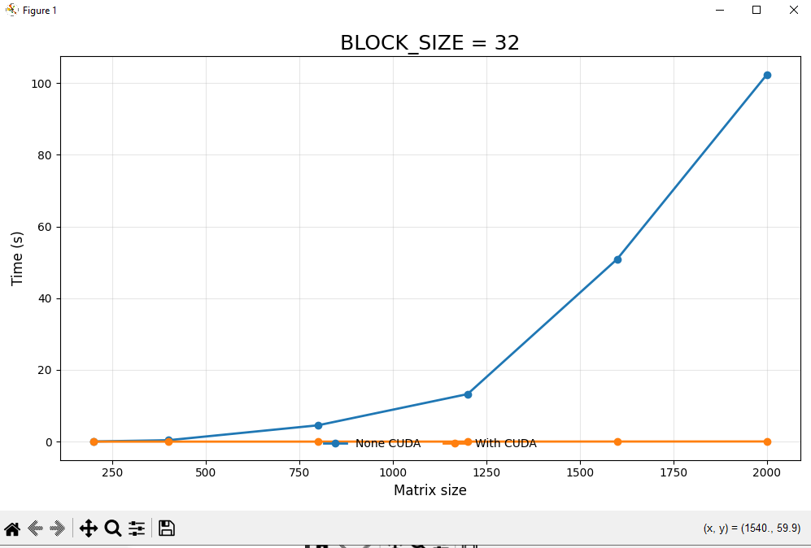

# Лабораторная работа №4: Параллельное перемножение матриц на GPU (CUDA)

**Выполнил:** Чан Минь Ньят  
**Группа:** 6213  

---

## 1. Цель работы

Целью лабораторной работы является реализация алгоритма умножения квадратных матриц с использованием графического ускорителя (GPU) по технологии **NVIDIA CUDA** и сравнение его производительности с последовательной реализацией на **CPU**.

В ходе работы необходимо:

- реализовать последовательное перемножение матриц на CPU;
- реализовать параллельное перемножение матриц на GPU с использованием CUDA;
- провести серию экспериментов для матриц различных размеров;
- исследовать влияние размера блока потоков (**block size**) на производительность GPU-версии;
- сравнить время выполнения CPU и GPU реализаций.

---

## 2. Описание реализации

Программа реализована на языке **C++** с использованием технологии **CUDA** (файл `kernel.cu`).

### 2.1. Последовательная реализация на CPU

Для CPU реализован классический алгоритм умножения квадратных матриц с тройным вложенным циклом:

- внешний цикл по строкам матрицы `A`;
- внутренний цикл по столбцам матрицы `B`;
- дополнительный цикл по индексу суммирования `k`.

Каждый элемент результирующей матрицы `C[i][j]` вычисляется по формуле:

\[
C[i][j] = \sum_{k=0}^{N-1} A[i][k] \cdot B[k][j]
\]

Измерение времени выполнения CPU-версии производится с помощью библиотеки `chrono`.

### 2.2. Реализация на GPU (CUDA)

Для GPU используется двумерная организация потоков:

- **2D Grid** — сетка блоков;
- **2D Block** — блок потоков.

Каждый поток вычисляет **один элемент** результирующей матрицы `C[row][col]`.

Основные этапы работы CUDA-программы:

1. Выделение памяти на GPU с помощью `cudaMalloc`.
2. Копирование матриц `A` и `B` из оперативной памяти на устройство функцией `cudaMemcpy`.
3. Запуск CUDA-ядра `multiplyMatrixGPU`.
4. Копирование результата `C` обратно на Host.
5. Измерение времени работы GPU с помощью `cudaEvent_t`.

Для исследования производительности были протестированы три конфигурации блоков:

- `8x8`
- `16x16`
- `32x32`

### 2.3. Проверка корректности

Для каждого размера матрицы выполнялось поэлементное сравнение результатов CPU и GPU.  
Во всех экспериментах получено:

- `correct = 1`

Это означает, что результаты CUDA-реализации полностью совпадают с результатами последовательного алгоритма на CPU.

---

## 3. Условия экспериментов

Эксперименты проводились при следующих параметрах:

- **Язык программирования:** C++ / CUDA
- **Компилятор:** `nvcc`
- **GPU:** NVIDIA Tesla T4
- **Исследуемые размеры матриц:** `200`, `400`, `800`, `1200`, `1600`, `2000`
- **Конфигурации блоков:** `8x8`, `16x16`, `32x32`
- **Тип данных:** `int`
- **Формат выходных данных:** `result.txt`

---

## 4. Результаты экспериментов

### 4.1. Время выполнения CPU и GPU

| Размер матрицы N | CPU (с) | GPU 8x8 (с) | GPU 16x16 (с) | GPU 32x32 (с) |
|---|---:|---:|---:|---:|
| 200  | 0.0446882 | 0.000253344 | 0.00008192  | 0.00010912 |
| 400  | 0.392447  | 0.000534688 | 0.000345504 | 0.000333792 |
| 800  | 4.55185   | 0.00699485  | 0.00438659  | 0.0031703 |
| 1200 | 13.2588   | 0.0188216   | 0.0124252   | 0.0111462 |
| 1600 | 50.9103   | 0.0557556   | 0.036214    | 0.0256963 |
| 2000 | 102.342   | 0.0885161   | 0.0508273   | 0.0445133 |

### 4.2. Производительность (GOPS)

| Размер матрицы N | CPU (GOPS) | GPU 8x8 | GPU 16x16 | GPU 32x32 |
|---|---:|---:|---:|---:|
| 200  | 0.358036 | 63.1552 | 195.313 | 146.628 |
| 400  | 0.326159 | 239.392 | 370.473 | 383.472 |
| 800  | 0.224964 | 146.393 | 233.439 | 322.997 |
| 1200 | 0.260657 | 183.619 | 278.144 | 310.061 |
| 1600 | 0.160911 | 146.927 | 226.211 | 318.801 |
| 2000 | 0.156339 | 180.758 | 314.792 | 359.443 |

### 4.3. Графики

### BLOCK_SIZE = 8

### BLOCK_SIZE = 16

### BLOCK_SIZE = 32

## 5. Анализ результатов

Результаты экспериментов показывают, что CUDA-реализация значительно превосходит последовательную версию на CPU уже начиная с небольших размеров матриц. Наименьшее время на GPU во всех крупных тестах достигается при использовании блока `32x32`, тогда как для `N = 200` лучший результат показала конфигурация `16x16`.

Для лучших конфигураций ускорение относительно CPU составило примерно:

- для `N = 200` — около **545 раз**;
- для `N = 400` — около **1176 раз**;
- для `N = 800` — около **1436 раз**;
- для `N = 1200` — около **1190 раз**;
- для `N = 1600` — около **1981 раз**;
- для `N = 2000` — около **2299 раз**. 

Конфигурация `8x8` во всех случаях работает медленнее, чем `16x16` и `32x32`, что объясняется менее эффективной загрузкой потоковых мультипроцессоров GPU. Конфигурации `16x16` и `32x32` показывают значительно лучшую производительность, а при больших размерах матрицы наиболее эффективной оказалась конфигурация `32x32`.

Также видно, что с увеличением размера задачи преимущество GPU над CPU становится все более выраженным. Это связано с тем, что для вычислительно интенсивных задач архитектура GPU позволяет одновременно выполнять большое количество однотипных операций.

---

## 6. Выводы

В ходе лабораторной работы была разработана программа для перемножения квадратных матриц на GPU с использованием технологии CUDA, а также выполнено сравнение с последовательной реализацией на CPU.

По результатам экспериментов можно сделать следующие выводы:

1. CUDA обеспечивает многократное ускорение по сравнению с CPU.
2. Для данной задачи GPU наиболее эффективен при размерах блока `16x16` и `32x32`.
3. Для больших матриц наилучшие результаты показывает конфигурация `32x32`.
4. Реализация на GPU полностью корректна, так как результаты совпадают с CPU-версией во всех тестах.

---

